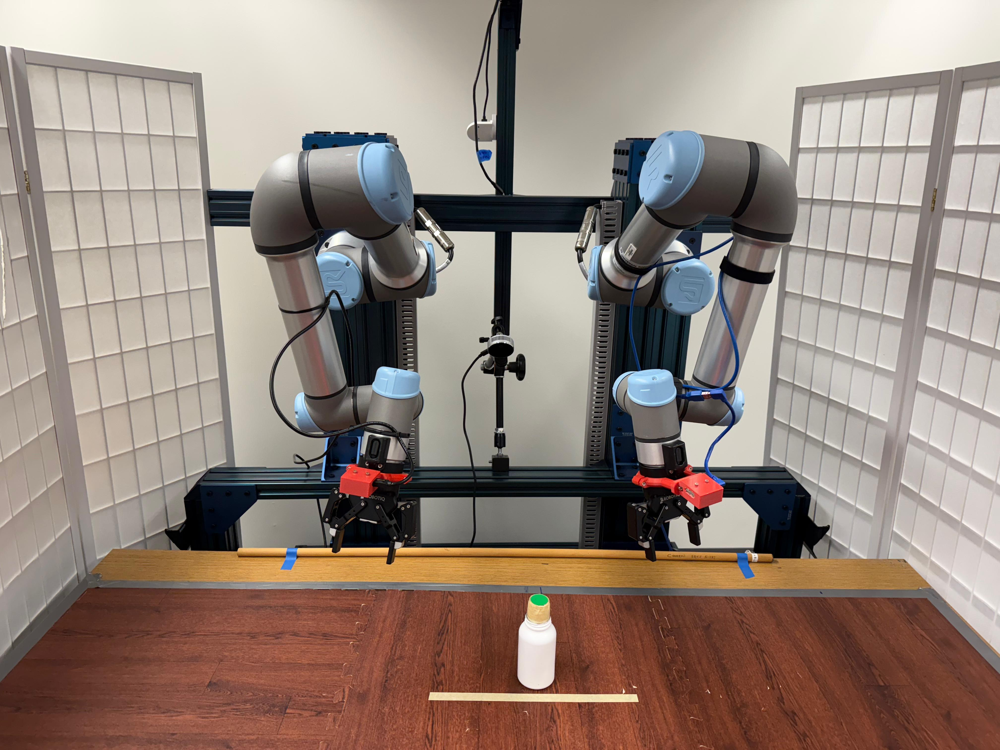

<p align="center">
  <h1 align="center">The Real Bartender</h1>
</p>
<p align="center">
  <h3 align="center">Course Project for CSCI 5980: Deep Learning for Robot Manipulation</h3>
</p>



<!-- TODO: Add project website -->

### Environment Setup
This code was developed and tested with Python 3.9

Clone this repository to your local machine by running the following command in your terminal:
```shell
git clone https://github.com/mohitydv09/the-real-bartender.git
cd the-real-bartender
```

Create a new mamba environment
```shell
mamba env create -f environment.yml
```

### Dataset

1. Create a new directory and download the dataset by running the following commands:

    ```shell
    mkdir dataset
    cd dataset
    wget --no-check-certificate 'TODO: add a drive link here' 
    cd ..
    ```

2. Alternatively, you can directly download the dataset from [TODO: add the same drive link here].

Additionally, you will need to create and store the stats file for the dataset. To do this, use the `scripts/get_stats.py` script.


### Training

1. Modify the path to the dataset inside the `config_.yaml` script. You can also experiment with other hyperparameters based on your task and hardware.

2. If you are using our dataset, you can train your policy by running the following commands:

    ```shell
    mamba activate real-bartender
    python train.py
    ```

3. If you are using your own custom dataset, modify the `dataloader class` in the `scripts/dataset.py` script, and adjust the `forward_pass` function in the `train.py` script to accommodate your custom dataset and task.

### Inference

To test the diffusion policy after training your model:

1. First, modify the `scripts/get_observations.py` file to stream the environment observations and robot states required for the diffusion policy network.

2. Update the `model_path` inside the `config_.yaml` script to point to your trained model.

3. Finally, read and modify the `inference.py` script to run inference using your trained model on your real robot setup.


